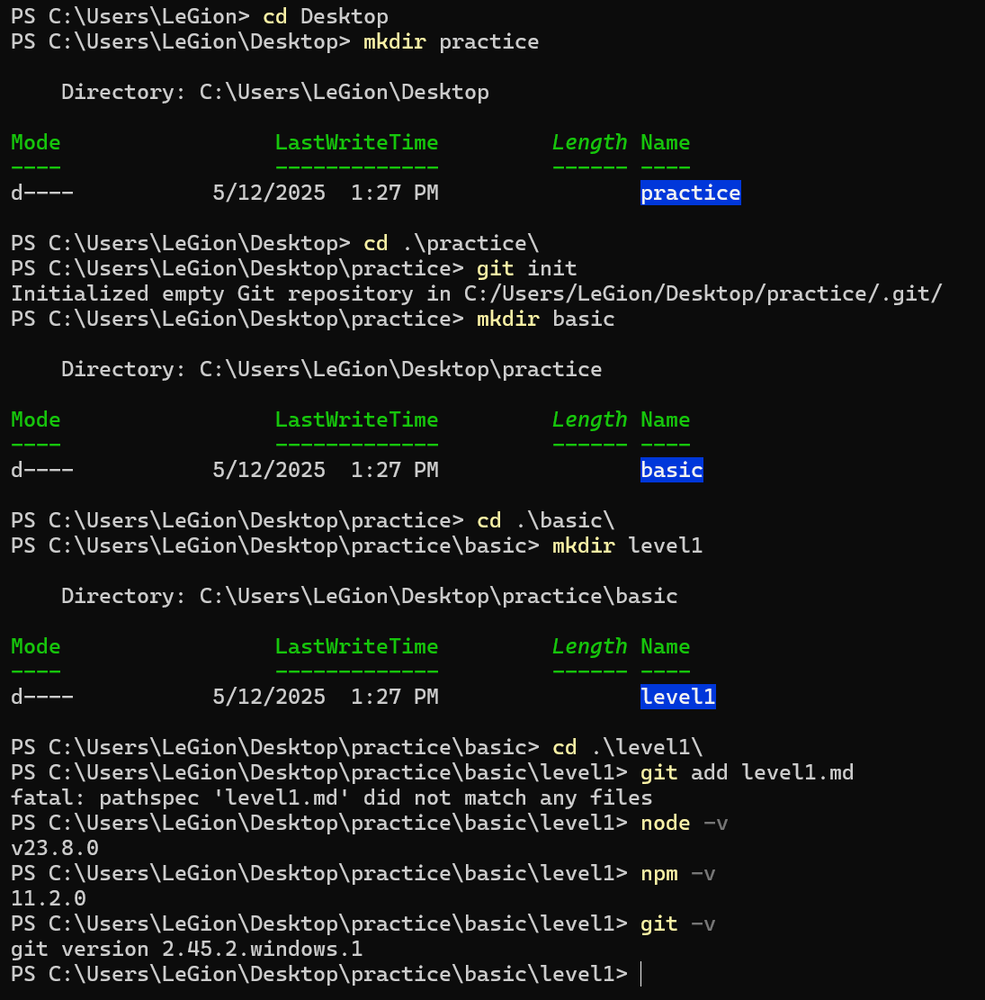
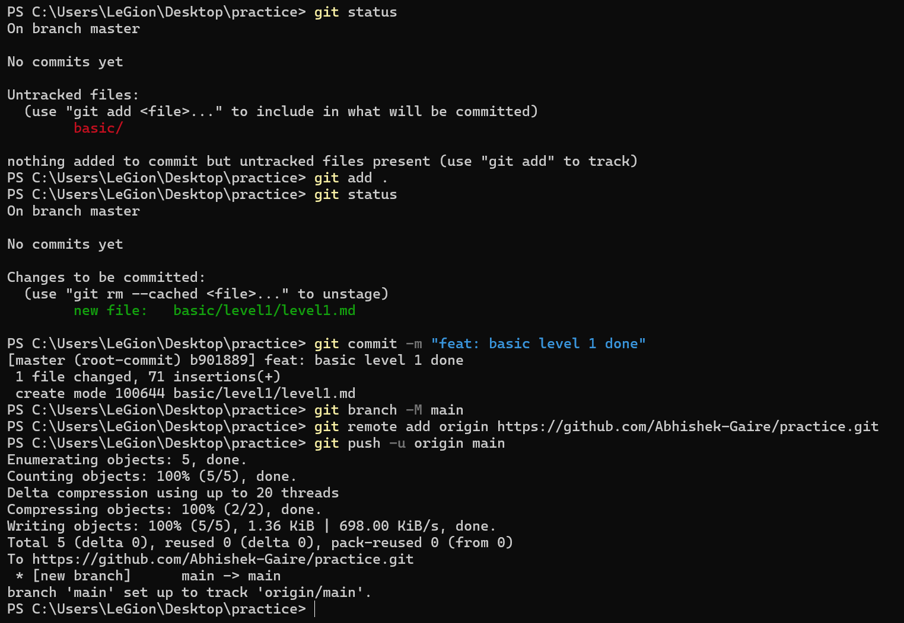

# Level 1 Documentation: Setup Development Environment

## Date
- **Completed On**: May 12, 2025

## Steps Performed

### 1. **Create Project Directory**
- Created a main directory named `practice` on the desktop.
    - Command: `mkdir practice`
    - Location: `C:\Users\Legion\Desktop\practice`
    - Date: May 12, 2025, 1:27 PM

### 2. **Initialize Git Repository**
- Initialized an empty Git repository in the `practice` directory to enable version control.
    - Command: `git init`
    - Output: `Initialized empty Git repository in C:/Users/Legion/Desktop/practice/.git/`
    - Date: May 12, 2025, 1:27 PM

### 3. **Create Subdirectory for Basic Level**
- Created a subdirectory named `basic` within the `practice` directory to organize basic-level tasks.
    - Command: `mkdir basic`
    - Location: `C:\Users\Legion\Desktop\practice\basic`
    - Date: May 12, 2025, 1:27 PM

### 4. **Create Subdirectory for Level 1**
- Created a subdirectory named `level1` within the `basic` directory to store files specific to Task 1.
    - Command: `mkdir level1`
    - Location: `C:\Users\Legion\Desktop\practice\basic\level1`
    - Date: May 12, 2025, 1:27 PM

### 6. **Check Environment**
- Verified Node.js and npm versions to ensure they are installed (as required by the task).
    - Commands:
        - `node -v`
        - `npm -v`
    - Output: v23.8.0
    - Output: v11.2.0
- Verified Git version.
    - Command: `git --version`
    - Output: `git version 2.45.2.windows.1`

### 7. **Check Git Status**
- Checked the status of the repository to identify untracked files.
  - Command: `git status`
  - Output: On branch master
    No commits yet 
    - Untracked files:
    - `basic/`
     
  
### 7. **Add and Commit Initial Files**
- Added a README.md file to the repository.
    - Command: `git add .`
- Committed the staged changes with a descriptive message.
- Command: `git commit -m "feat: basic level 1 done"`

### 8. **Set Main Branch**
- Renamed the default branch to `main`.
    - Command: `git branch -M main`

### 9. **Connect to Remote Repository**
- Added a remote repository on GitHub.
    - Command: `git remote add origin https://github.com/Abhishek-Gaire/practice.git`

### 10. **Push to Remote Repository**
- Pushed the local repository to the remote GitHub repository.
    - Command: `git push -u origin main`

## Screenshots
Below is a screenshot of the terminal showing the initial setup process:

## Objectives Achieved
- [x] Installed and configured Node.js and npm.
- [x] Set up a GitHub repository and learned basic Git commands (`git init`, `git add`,`git commit`, `git push`, `git remote add`, `git branch`,`git status`).
- [x] Installed a database (MongoDB/MySQL/PostgreSQL) - Installed MongoDB via MongoDB Compass, MySQL via XAMPP, and PostgreSQL via pgAdmin; DBeaver is set up for managing these databases.
- [x] Learned basic terminal commands (`mkdir`, `cd`,`clear`,`list`,`echo`).
