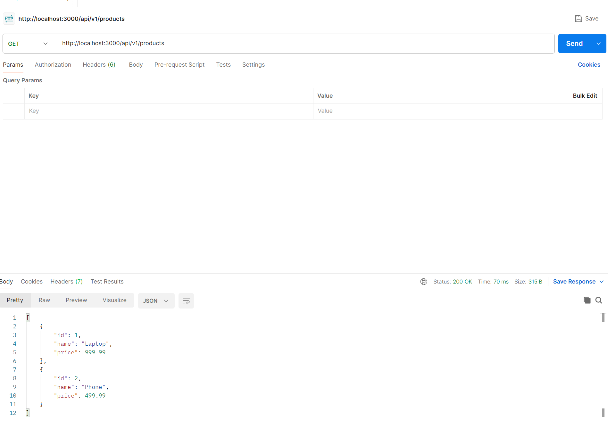
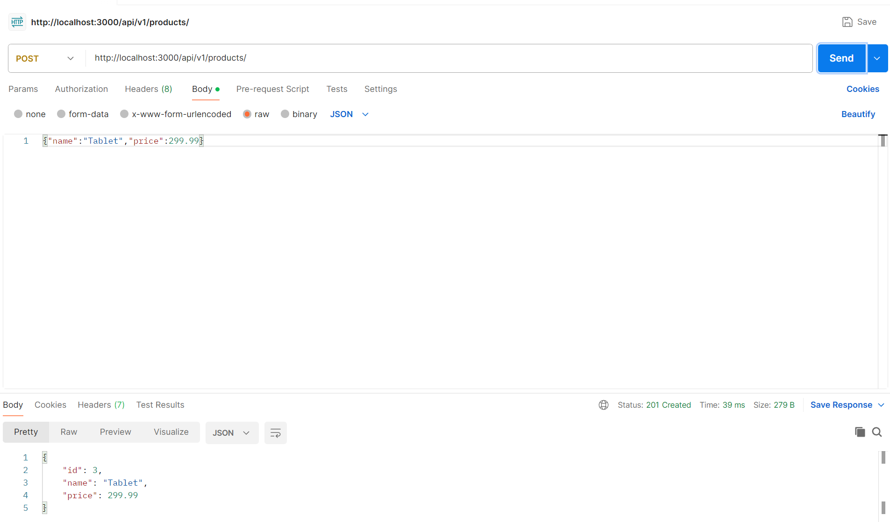
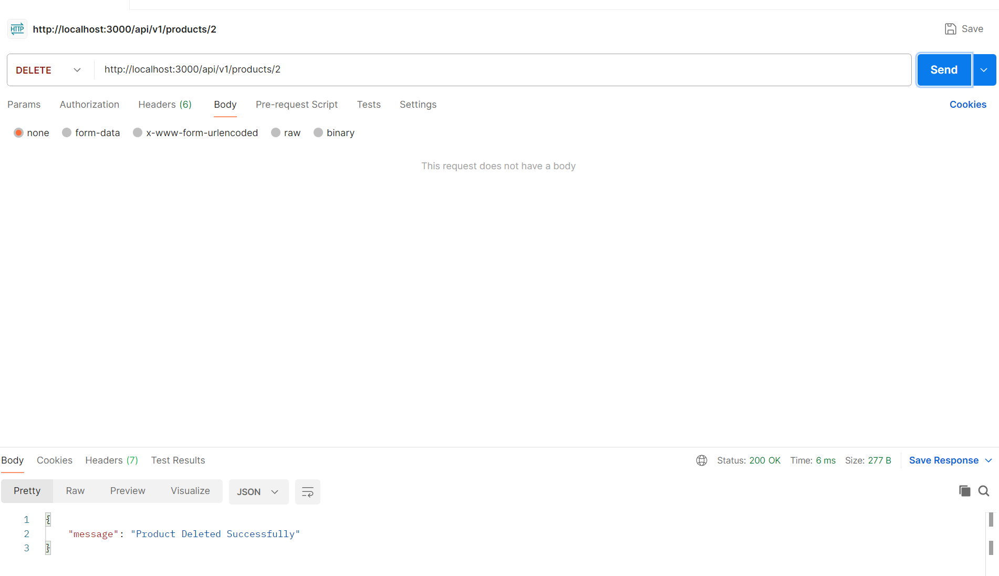

# Level 2 Documentation: Build a Simple REST API

## Date
- **Completed On**: May 12, 2025

## Steps Performed

### 1. **Set Up Project Directory**
- Created a directory named `level2` inside `basic` to store this task.
    - Command: `mkdir level2`
    - Location: `C:\Users\Legion\Desktop\practice\basic\level2`

### 2. **Initialize Node.js Project**
- Initialized a new Node.js project.
    - Command: `npm init -y`
- Installed Express.
    - Command: `npm install express`

### 3. **Develop REST API**
- Created a file named `index.js` with the Express server.
- Created a file named `controllers.js` that has all the logical functions.
- Created a file named `route.js` that has routes specified and controllers connected.
- Implemented GET, POST, PUT, and DELETE routes.
- Added error handling for invalid requests and server errors.

### 4. **Run the Server**
- Started the server.
    - Command: `node index.js`
    - Output: `Server running at http://localhost:3000`

## API Testing Results

### 1. **GET /api/v1/products**
- Response: `200 OK`
- Output: Returned a JSON array of all products (e.g., `[{"id":1,"name":"Laptop","price":999.99},{"id":2,"name":"Phone","price":499.99}]`).
- Screenshot:
  

### 2. **GET /api/v1/products/1**
- Response: `200 OK`
- Output: Returned the product with ID 1 (e.g., `{"id":1,"name":"Laptop","price":999.99}`).
- Tested with a non-existent ID (e.g., `/api/products/999`):
  - Response: `404 Not Found`
  - Output: `{"error":"Product not found"}`
- Screenshot:
  

### 3. **POST /api/v1/products**
- Request Body: `{"name":"Tablet","price":299.99}`
- Response: `201 Created`
- Output: Added a new product (e.g., `{"id":3,"name":"Tablet","price":299.99}`).
- Tested with missing fields (e.g., `{"name":"Tablet"}`):
  - Response: `400 Bad Request`
  - Output: `{"error":"Name and price are required"}`
- Screenshot:
  

### 4. **PUT /api/v1/products/1**
- Request Body: `{"name":"Updated Laptop","price":1099.99}`
- Response: `200 OK`
- Output: Updated the product (e.g., `{"id":1,"name":"Updated Laptop","price":1099.99}`).
- Tested with a non-existent ID:
  - Response: `404 Not Found`
  - Output: `{"error":"Product not found"}`
- Screenshot:
  

### 5. **DELETE /api/v1/products/2**
- Response: `200 OK`
- Output: Product Deleted Successfully.
- Tested with a non-existent ID:
  - Response: `404 Not Found`
  - Output: `{"error":"Product not found"}`
- Screenshot:
  

## Objectives Achieved
- [x] Set up an Express server.
- [x] Created API routes for CRUD operations.
- [x] Tested API endpoints using Postman - All routes work as expected with proper HTTP responses and error handling.
- [x] Handled errors and returned proper HTTP responses.

## Notes
- The API currently uses an in-memory array for data storage, which will be replaced with a database in future tasks.
