# Intermediate Level 2 Documentation: Backend with Authentication and Authorization

## Date
- **Completed On**: May 13, 2025

## Steps Performed

### 1. **Set Up Project Directory**
- Created a directory named `intermediate/level2` to store this task.
  - Command: `mkdir intermediate/level2`
  - Location: `C:\Users\Legion\Desktop\practice\intermediate\level2`

### 2. **Initialize Node.js Project**
- Initialized a new Node.js project.
  - Command: `npm init -y`
- Installed required dependencies.
  - Commands: `npm install express mongoose jsonwebtoken bcryptjs cors dotenv`
  - `npm install -D nodemon`

### 3. **Configure Environment and Database**
- Created a `.env` file with `PORT`, `JWT_SECRET`, and `MONGODB_URI`.
- Ensured MongoDB is running locally.

### 4. **Develop Backend API**
- Set up an Express server with MongoDB connection.
- Defined `User` and `Product` schemas.
- Implemented JWT authentication middleware.
- Added role-based authorization middleware for admin-only routes.
- Created API endpoints:

### API Endpoints and Example Requests

### POST `/api/v1/register` - User Registration

- Registers a new user.

**Request Example:**  
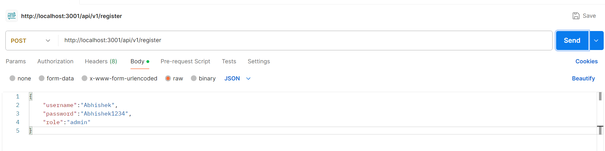 

**Response Example:**  
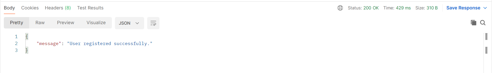 

### POST `/api/v1/login` - User Login

- Logs in a user and returns a JWT token.

**Request Example:**  
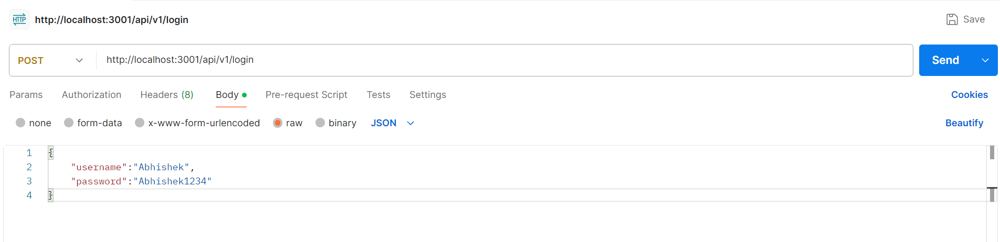 

**Response Example:**  
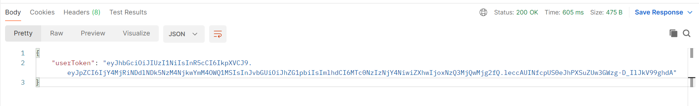 

### GET `/api/v1/products` - Get All Products (Public)

- Returns a list of products (no authentication required).

**Request Example:**  
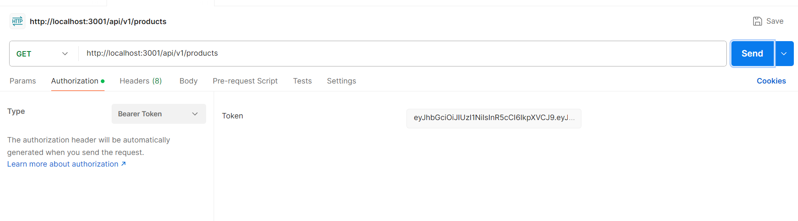 

**Response Example:**  
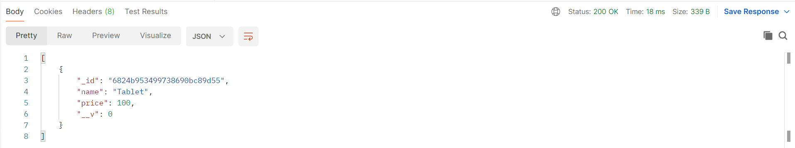 <!-- Add your image here -->

### GET `/api/v1/products/:id` - Get Product by ID (Admin Only)

- Returns details of a single product (admin authentication required).

**Request Example:**  
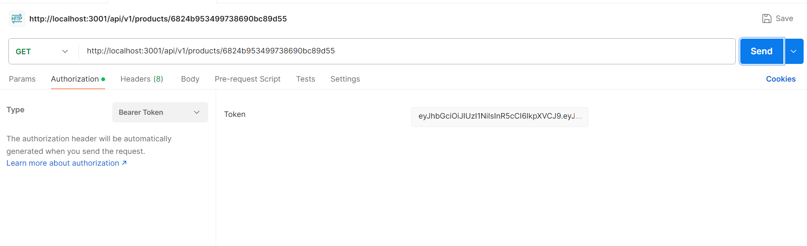 <!-- Add your image here -->

**Response Example:**  
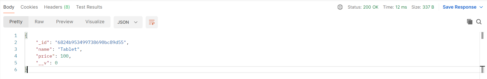 <!-- Add your image here -->

### POST `/api/v1/products` - Create Product (Admin Only)

- Creates a new product (admin authentication required).

**Request Example:**  
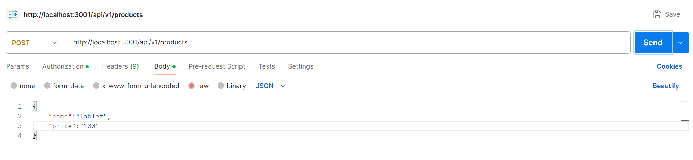 

**Response Example:**  
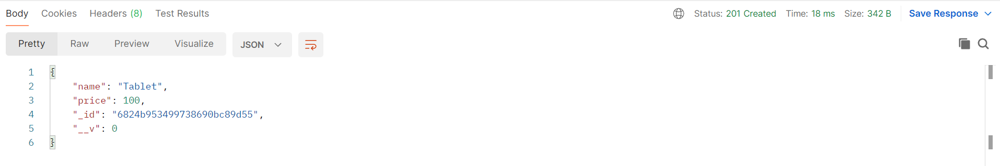 

**No Token:**
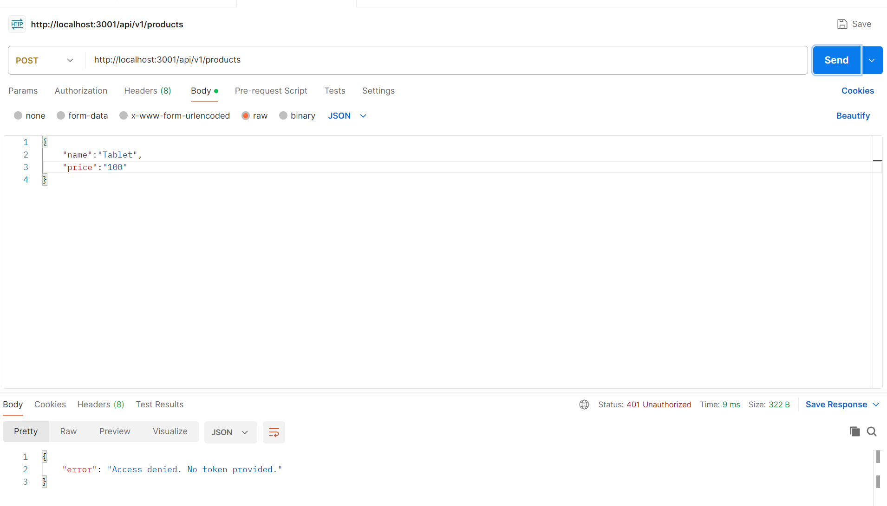

### PUT `/api/v1/products/:id` - Update Product (Admin Only)

- Updates a product (admin authentication required).

**Request Example:**  
 

**Response Example:**  
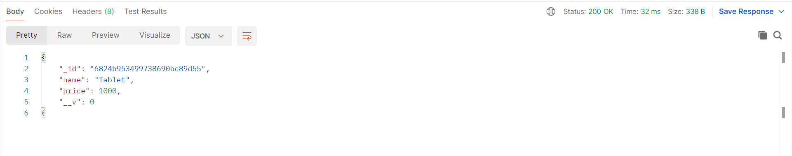 

**No Token:**
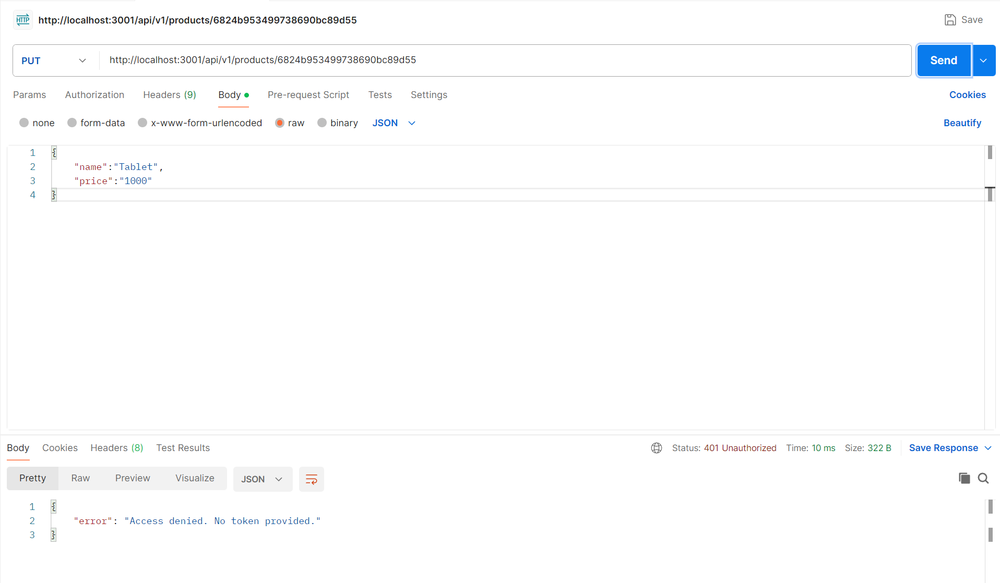

### DELETE `/api/v1/products/:id` - Delete Product (Admin Only)

- Deletes a product (admin authentication required).

**Request Example:**  
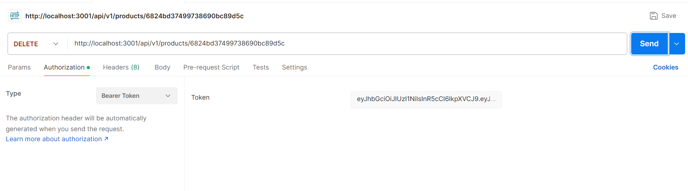 

**Response Example:**  
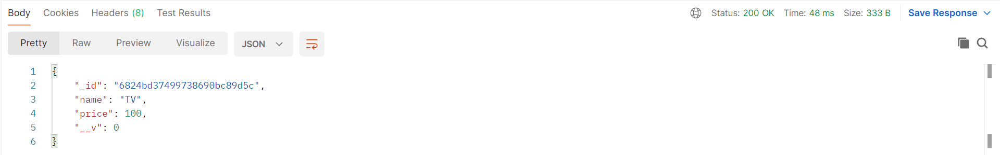

### 5. **Test the API**
- Ran the server with `npm start`.
- Tested endpoints using Postman:
  - Registered an admin user.
  - Logged in to get a JWT token.
  - Accessed public and protected routes, verifying authorization.

## Objectives Achieved
- [x] Implemented user authentication using JWT.
- [x] Added role-based authorization to restrict access to certain routes.
- [x] Used MongoDB to store user and product data.
- [x] Secured API endpoints with middleware.

## Notes
- The API uses bcrypt for password hashing and JWT for secure authentication.
- Only admins can create, update, or delete products, while all users can view the list.
